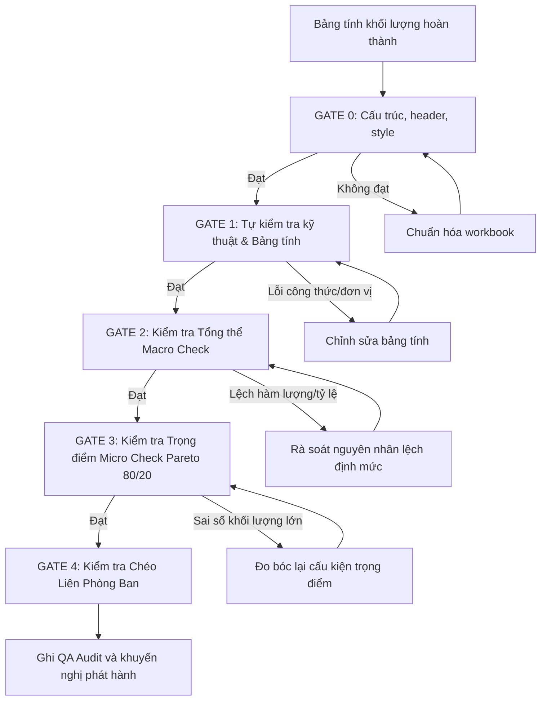

# Goal

Đóng vai trò là **Senior QS / Kỹ sư Trưởng Đo bóc Khối lượng CSA**, hướng dẫn, trực tiếp thực hiện hoặc kiểm tra công tác đo bóc khối lượng (Quantity Takeoff) cho các dự án Xây dựng Dân dụng & Công nghiệp.

> [!IMPORTANT]
> **PHẠM VI TRỌNG TÂM CỦA SKILL: QUY TẮC VÀ KIỂM TRA BOQ KỸ THUẬT 5 CỘT (A - E)**
> Skill này là **BỘ CÔNG CỤ ĐO BÓC KHỐI LƯỢNG THUẦN TÚY (Pure Quantity Takeoff)**, chỉ tập trung xử lý và chịu trách nhiệm cho **5 CỘT KỸ THUẬT TỪ A ĐẾN E** theo đúng chuẩn form BOQ Tổng thầu (ASCO):
> - **Cột A - STT / Mã hiệu (Item No. / WBS):** Hệ thống mã phân cấp công tác chuẩn WBS (I, II, III...; A, B, C...; 1, 2, 3...; 1.1, 1.2...). Canh giữa, bold.
> - **Cột B - Diễn giải (Description / 描述):** Tên công việc chi tiết, mác vật liệu, kích thước hình học, cấp độ chống cháy, điều kiện thi công. BẮT BUỘC THỂ HIỆN TAM NGỮ (Dòng 1: Tiếng Việt TCVN, Dòng 2: English FIDIC, Dòng 3: 中文 GB 50500) được dịch đúng ngữ cảnh kỹ thuật xây dựng bằng Gemini, TUYỆT ĐỐI KHÔNG DÙNG GOOGLE TRANSLATE. Độ rộng cột 65, canh trái, wrap text.
> - **Cột C - Đơn vị (Unit / 单位):** Đơn vị đo bóc chuẩn mực ($m, m^2, m^3, kg, \text{Tấn}, \text{Cái/Nos}, \text{Bộ/Set}, \text{Lot}$). Canh giữa.
> - **Cột D - Khối lượng (Quantity / 数量):** Khối lượng hình học chuẩn xác tính trực tiếp từ CAD. BẮT BUỘC **IN ĐẬM (`bold=True`)**, canh phải, format `#,##0.00`.
> - **Cột E - Công thức tóm tắt & Calc ID (Quick Formula / 计算索引):** BẮT BUỘC theo mẫu `Location=...; Geometry=...; Deductions=...; Calc ID=...`. Mọi item có khối lượng phải có `Calc ID`; cột này là lớp crosscheck nhanh, BẮT BUỘC *IN NGHIÊNG (`italic=True`)*, canh trái, wrap text; audit trail đầy đủ nằm ở `Takeoff_Calculation`.
> 
> 🚫 **QUY TẮC TOÀN VẸN DỮ LIỆU (DATA INTEGRITY — 1 ITEM = 1 SINGLE ROW):**
> Mỗi công tác dự toán BẮT BUỘC chỉ chiếm đúng **1 HÀNG DUY NHẤT** trên BOQ. Cột E là lớp kiểm tra nhanh; phép tính chi tiết theo nhiều phòng/cấu kiện/lỗ mở được lưu tại `Takeoff_Calculation`, liên kết bằng `Calc ID`.
> 
> 🚫 **TUYỆT ĐỐI KHÔNG QUAN TÂM:** Các cột Đơn giá (Unit Rate), Thành tiền (Amount), Tỷ giá ngoại tệ (USD), hay các cột phân tích tài chính/thương mại.

## 0. RANH GIỚI PHÁT HÀNH VÀ CHUẨN DÙNG CHUNG

Đọc và áp dụng [Chuẩn đo bóc CSA dùng chung](C:/Users/TVCHUONG/.gemini/config/plugins/csa-takeoff-suite/references/csa_measurement_standard.md) trước khi thực hiện. Tài liệu này là nguồn duy nhất cho thứ tự ưu tiên hồ sơ, quy tắc mở lỗ, ván khuôn, hao hụt và cân bằng đất; nếu có mâu thuẫn với ví dụ cũ trong skill này thì ưu tiên tài liệu chuẩn.

- Dự án có nhiều gói hoặc cần workbook chính thức: bàn giao dữ liệu chuẩn cho `csa-orchestrator`; không tự tạo BOQ phát hành.
- Khi được gọi độc lập, chỉ tạo bảng kiểm tra/đo bóc phục vụ review, không tự tuyên bố là BOQ phát hành.
- Bàn giao tối thiểu: WBS, `Calc ID`, vị trí/cấu kiện, bản vẽ & revision, nguồn hình vẽ, công thức, khấu trừ/cơ sở đo, ĐVT, khối lượng, trạng thái dữ liệu, `Quantity Class=NET_DESIGN|PROCUREMENT_ONLY` và (nếu là đất) `EARTHWORK_STATE`.
- Revision phải được đối chiếu với `Document Register` do orchestrator cung cấp. Chỉ dữ liệu `Verified` + `NET_DESIGN`, khớp WBS/ĐVT/tổng khối lượng với BOQ.D, mới đủ điều kiện đi vào BOQ phát hành.
- Không tạo hoặc chạy script Python xuất Excel thủ công. Nếu user yêu cầu workbook chính thức, bàn giao dữ liệu cho `csa-orchestrator` để agent này dùng độc quyền `csa_excel_styler.py`.

---

# Instructions

## 1. NGUYÊN TẮC ĐO BÓC KHỐI LƯỢNG KẾT CẤU (STRUCTURAL)

### 1.1. Công tác đất & Phần ngầm
* **Đào đất:**
  * Luôn phối hợp với Biện pháp thi công (BPTC): Đào mở taluy hay ép cừ Larsen; đào toàn bộ (đào ao) hay đào cục bộ (đào móng độc lập, móng băng).
  * Kiểm tra cấp đất và xác định độ dốc taluy theo BPTC.
  * **Hạn chế tự ý nhân hệ số nở rời/đầm nén 1.3** vào khối lượng hình học trừ khi chỉ dẫn kỹ thuật (Spec) hoặc phương pháp đo bóc quy định rõ.
  * Phải làm rõ cao độ đất tự nhiên hiện trạng và cao độ san lấp thiết kế để xác định chiều sâu đào thực tế.
* **Đắp đất & Vận chuyển:**
  * Lập cân bằng riêng cho đất nguyên thổ đào, đất tơi vận chuyển, đất đắp đã đầm, đất tái sử dụng, đất mua ngoài và đất thừa đổ đi.
  * Ghi hệ số nở rời/đầm nén, taluy, không gian thao tác, shoring và tuyến vận chuyển chỉ khi hợp đồng, spec hoặc biện pháp được duyệt quy định.
  * Làm rõ điều kiện hợp đồng: Đất đào lên có được tận dụng đắp lại hay phải vận chuyển đổ đi toàn bộ và mua đất mới (đất đồi/cát san lấp) về đắp?
* **Công tác cọc (Piling):**
  * Phân biệt rõ cọc ép âm và ép dương để tính toán chiều dài thi công cọc và công tác đào ép âm/khoan dẫn.
  * Tách riêng **Cọc thí nghiệm** và **Cọc đại trà**.
  * Bóc tách riêng: Ống siêu âm (thép/nhựa), ống khoan lấy lõi đáy cọc; vữa không co ngót cường độ cao (non-shrink grout) điền đầy ống siêu âm sau thí nghiệm (làm rõ mác vữa).
  * Khối lượng thí nghiệm cọc: Nén tĩnh, PDA, siêu âm cọc, Koden, khoan lấy lõi đáy cọc.
  * Đối chiếu mặt cắt địa chất để phân định chiều dài cọc khoan vào tầng đất vs cọc ngàm vào tầng đá.
* **Tường vây (Diaphragm Wall):**
  * Tính toán thanh cản nước (Waterstop) theo cả phương đứng (giữa các panel) và phương ngang (tại mạch ngừng thi công).
  * Chi tiết liên kết dầm/sàn tầng hầm vào tường vây: Xốp cứng chèn đầu thép, thanh trương nở chống thấm, hoặc khoan cấy bulong/thép râu.
* **Chống mối (Termite Protection):**
  * Bóc tách riêng: Chống mối mặt nền (m²), hào chống mối chân tường (m hoặc m³).
  * Lưu ý bóc chống mối toàn bộ bề mặt tiếp xúc đất của đài móng, dầm móng theo chỉ định thiết kế.

### 1.2. Cốt thép (Rebar)
* **Quy tắc nối chồng:**
  * Chiều dài nối chồng tính theo **đường kính thanh thép lớn hơn** (hoặc theo bảng ghi chú chung của hồ sơ thiết kế).
  * Nối thép cột, vách: Tính 1 tầng nối 1 lần; đối với các tầng cao $> 6\,\text{m}$, phối hợp BPTC để xác định số lần nối phù hợp chiều dài cây thép thương phẩm ($11.7\,\text{m}$).
* **Cấu tạo & Thép biện pháp bắt buộc phải tính:**
  * Thép neo chờ từ móng/cột/vách.
  * Thép chân chó (ghế kê cốt thép) cho sàn 2 lớp thép (thường tính $\approx 1\,\text{cái}/\text{m}^2$).
  * Thép đai chụp chữ U tại đài móng, mép vách lõi thang máy.
  * Thép gia cường sàn tại vị trí có tường xây bên trên (khi không có dầm đỡ).
  * Thép đai dầm đi qua nút giao bên trong lòng cột (nhiều bản vẽ không vẽ nhưng quy chuẩn bắt buộc có).
  * Thép gia cường nách dầm giật cấp, dầm giao nhau, xung quanh lỗ mở kỹ thuật, sleeve MEP.
  * Thép con kê, thép giá cho bể nước, hồ ngầm.

### 1.3. Ván khuôn (Coffa / Formwork)
* **Phạm vi mặt coffa:** Chỉ tính bề mặt thực sự cần coffa theo biện pháp và hợp đồng; không mặc định tính mặt đổ trực tiếp trên đất, lớp bê tông lót hoặc bề mặt đã thay coffa.
* **Quy tắc trừ giao:**
  * Trừ giao dầm vào cột, dầm phụ vào dầm chính, dầm vào vách.
* **Lỗ mở:**
  * Chỉ áp dụng ngưỡng không trừ khi hợp đồng, specification, phương pháp đo bóc hoặc ghi chú bản vẽ cho phép. Nếu không, trừ theo hình học thực tế và ghi cơ sở đo.
* **Phân loại bắt buộc trong BOQ:**
  * Phân loại theo chiều cao sàn thi công: Chiều cao thông thường ($\le 6\,\text{m}$) vs sàn thông tầng ($> 6\,\text{m}$ do phải dùng hệ giáo chống shoring đặc thù).
  * Phân loại theo cấu kiện: Móng, cột, vách, dầm, sàn, cầu thang, dầm sàn chuyển (transfer beam/slab), trụ độc lập.
  * Phân loại hình học: Mặt phẳng vs mặt nghiêng (mái dốc, đáy phễu), mặt cong, vòm.
  * Giật cấp sàn, ván khuôn biên sàn, bậc tam cấp phải tính thành mục riêng.

### 1.4. Bê tông (Concrete)
* **Phân loại mác bê tông:** Luôn bóc tách theo đúng mác thiết kế (C20, C25, C30, C35...) và vị trí (bê tông lót mác thấp vs bê tông kết cấu).
* **Ranh giới tính toán cấu kiện:**
  * **Cột, vách:** Tính từ mặt sàn dưới đến **đáy sàn/đáy dầm tầng trên**.
  * *Ngoại lệ nút giao cột - dầm sàn:* Nếu mác bê tông cột cao hơn dầm sàn từ 2 cấp mác trở lên, phần đầu cột giao dầm sàn phải tính theo mác bê tông của cột (và biện pháp ngăn lưới đổ bê tông mác cao).
  * **Dầm:** Tính từ mép cột/vách đến mép cột/vách đối diện, chiều cao tính từ đáy dầm đến đáy sàn.
  * **Sàn:** Tính diện tích trùm phủ toàn bộ mặt bằng sàn (không trừ phần dầm chiếm chỗ; không trừ phần giao cột nếu cùng mác).
* **Lỗ mở:**
  * Chỉ áp dụng ngưỡng không trừ khi hợp đồng, specification, phương pháp đo bóc hoặc ghi chú bản vẽ cho phép. Nếu không, trừ theo hình học thực tế và ghi cơ sở đo.
  * **KHÔNG TRỪ thể tích cốt thép chiếm chỗ trong bê tông**.
* **Hạng mục tách riêng:**
  * Bê tông lót móng/sàn hầm (mác thấp, chiều dày $50 - 100\,\text{mm}$).
  * Xử lý khe lún, khe co giãn, khe cô lập, vát nách dầm/cột.

---

## 2. NGUYÊN TẮC ĐO BÓC HOÀN THIỆN KIẾN TRÚC (ARCHITECTURAL & FINISHES)

### 2.1. Công tác Xây tường (Masonry)
* **QUY TẮC ĐỒNG BỘ KHUNG BÊ TÔNG ĐẤU THẦU (TENDER SINGLE RC BASELINE RULE):**
  * Trong giai đoạn làm BOQ đấu thầu, khi bản vẽ Kiến trúc chưa cập nhật đúng kích thước cột/dầm của Kết cấu: **BẮT BUỘC dùng đúng tiết diện cột và chiều sâu dầm của BẢN VẼ KẾT CẤU để khấu trừ khối lượng xây, trát, sơn** (*Nguyên tắc "Bê tông bóc ở đâu thì trừ ở đó"*).
  * Tuyệt đối KHÔNG trừ theo cột/dầm tượng trưng của bản vẽ Kiến trúc cũ để tránh lỗi tính trùng lặp kép (Double counting) hoặc sai lệch giá dự thầu.
  * Chiều cao xây thô: $H_{\text{xây}} = H_{\text{tầng}} - h_{\text{dầm Kết cấu}}$.
  * Trường hợp cột/dầm Kết cấu lớn hơn bề dày tường Kiến trúc ($b_{\text{cột}} > d_{\text{tường}}$ tạo cột/dầm lồi): **Bắt buộc tính bổ sung diện tích trát cạnh cột lồi ($2 \times \text{Độ lồi} \times H$), gờ đáy dầm và nhân đôi chiều dài lưới thép chống nứt**.
  * Với hợp đồng Trọn gói (Lump Sum): Bắt buộc ghi chú làm rõ cơ sở đo bóc theo Kết cấu trong cột diễn giải để bảo vệ chi phí.
* **Trừ giao:**
  * Trừ toàn bộ thể tích bê tông chiếm chỗ: Cột, dầm, lanh tô, giằng tường, bổ trụ.
* **Lỗ mở:**
  * Chỉ áp dụng ngưỡng không trừ khi hợp đồng, specification, phương pháp đo bóc hoặc ghi chú bản vẽ cho phép. Nếu không, trừ theo hình học thực tế và ghi cơ sở đo.
* **Quy chuẩn bố trí cấu kiện phụ:**
  * Bổ trụ bê tông cốt thép (thường $100\times 100$ hoặc $200\times 200\,\text{mm}$): Bố trí khi tường có chiều dài $L > 4\,\text{m}$ hoặc cạnh mép tường độc lập, cạnh cửa.
  * Giằng tường BTCT: Bố trí khi tường có chiều cao $H > 4\,\text{m}$, đầu tường lửng, lan can bồn hoa, chân bệ cửa sổ.
  * Gờ bê tông chân tường WC: Bắt buộc tính dải bê tông cao $100 - 200\,\text{mm}$ chân tường tiếp giáp sàn vệ sinh để chống thấm.
* **Phụ kiện liên kết & chống nứt:**
  * Thép râu tường: Bắt buộc tính thép râu neo vào cột/vách bê tông (khoảng cách tối đa $500\,\text{mm}$ dọc theo chiều cao tường) hoặc la thép khoan cấy.
  * Đóng lưới thép chống nứt: Bắt buộc tính tại các vị trí tiếp giáp giữa khối xây gạch và cấu kiện bê tông (băng lưới rộng $200\,\text{mm}$) và vị trí đục rãnh đi ống MEP âm tường.

### 2.2. Công tác Trát tường, Cột, Dầm (Plastering)
* **Quy tắc Chiều cao Trát tường trong nhà:**
  * **Phòng CÓ ĐÓNG TRẦN (trần thạch cao, trần nhôm, trần treo):** Chiều cao lớp trát tường **CAO HƠN CAO ĐỘ TRẦN HOÀN THIỆN 100mm** ($H_{\text{trát}} = H_{\text{trần}} + 0.10\,\text{m}$). Tuyệt đối không trát kịch sàn bê tông trên trần để tránh lãng phí.
  * **Phòng KHÔNG CÓ TRẦN:** Chiều cao lớp trát tường **CAO TỚI ĐÁY SÀN/MÁI PHÍA TRÊN** ($H_{\text{trát}} = H_{\text{thông thủy}}$).
* **Quy tắc Tách riêng Trát Cấu kiện Bê tông (Cột, Dầm):**
  * **LUÔN BÓC RIÊNG** khối lượng trát cột, dầm bê tông thành các mã công tác riêng biệt so với trát tường gạch (do khác biệt về đơn giá, định mức quét hồ dầu/Sika tạo nhám và đóng lưới chống nứt).
  * **Cột dính tường (cột biên/cột âm tường):** Bóc riêng khối lượng phần cột nhô ra khỏi mặt tường (cột lồi) tương tự như trát cột đứng độc lập:
    $$S_{\text{trát cột lồi}} = \sum (\text{Chu vi các cạnh nhô ra}) \times H_{\text{cột}}$$
  * **Dầm dính tường:** Bóc riêng phần đáy dầm và cạnh dầm nhô ra khỏi tường.
* **Quy tắc Trát & Sơn Mặt dưới Dầm, Sàn (Kế thừa từ Kết cấu):**
  * **Khu vực CÓ TRẦN TREO (thạch cao, trần nhôm):** Tuyệt đối KHÔNG trát và KHÔNG sơn mặt dưới dầm, sàn nằm phía trên trần ($= 0\,\text{m}^2$).
  * **Khu vực KHÔNG CÓ TRẦN (Canopy ngoài nhà, Sê-nô, Tầng hầm, Nhà xưởng lộ trần):**
    * **BẮT BUỘC LẤY SỐ LIỆU TỪ GÓI KẾT CẤU:** Kế thừa trực tiếp từ diện tích Ván khuôn đáy dầm và Ván khuôn đáy sàn do gói Kết cấu đã tính.
    * $S_{\text{đáy sàn}} = S_{\text{ván khuôn đáy sàn lọt lòng giữa dầm/cột}}$.
    * $S_{\text{đáy dầm}} = b_d \times L_{\text{thông thủy}} = S_{\text{ván khuôn đáy dầm}}$.
    * $S_{\text{cạnh dầm lộ}} = (h_d - t_{\text{sàn}}) \times L \times (\text{số mặt tiếp xúc không khí})$. (Dầm nằm trên tường xây kịch đáy chỉ tính 1 mặt cạnh ngoài; dầm độc lập giữa phòng tính 2 mặt cạnh).
  * **QUY TẮC PHÂN CHIA MÃ BOQ & LƯU Ý ĐƠN GIÁ TỔNG THẦU:**
    * **1. Phải tách riêng mã công tác trát trần so với trát tường:**
      * Trát mặt dưới sàn và dầm là **trát ngược (overhead plastering)**, tư thế thi công rất khó, vữa dễ rơi vãi, năng suất thợ chỉ bằng $60 - 70\%$ trát tường đứng.
      * Yêu cầu kỹ thuật bắt buộc: Phải đục nhám bê tông, quét hồ dầu kết dính hoặc vữa liên kết chuyên dụng (Sika Latex) trước khi trát.
      * $\rightarrow$ Đơn giá trát trần/đáy dầm luôn cao hơn trát tường từ $20 - 30\%$. Nếu gộp chung vào trát tường sẽ bị sai lệch chi phí nhân công.
    * **2. Sơn mặt dưới dầm/sàn:**
      * Khối lượng sơn trần lộ thiên $= S_{\text{trát trần BTCT tổng}}$ (bao gồm cả đáy sàn, đáy dầm và cạnh dầm).
      * Tách riêng thành mã: *"Bả matic và sơn nước trần/dầm bê tông lộ thiên"*.
    * **3. Chỉ ngắt nước (Drip-line) cho dầm biên / canopy:**
      * Tại mép dưới cùng của dầm biên hoặc mép bản canopy ngoài trời, **bắt buộc bóc riêng mét dài (`m`) rãnh ngắt nước $10\times 10\,\text{mm}$** hoặc nẹp chỉ ngắt nước dạng V/U để ngăn nước mưa chảy ngược vào đáy trần.
* **Phân loại:** Trát trong nhà vs trát ngoài nhà (vữa xi măng có phụ gia chống thấm); trát tường phẳng vs bề mặt cong/tròn; chiều dày lớp trát ($15\,\text{mm}, 20\,\text{mm}$...).
* **Hạng mục phụ tính riêng:**
  * Trát cạnh cửa sổ/cửa đi, trát gờ phào chỉ trang trí, trát chỉ ngắt nước seno/mái (tính theo mét dài `m`).
  * Nẹp góc nhựa/nhôm/inox bảo vệ góc dương (Corner bead).
  * Ron âm trang trí hoặc ron phân tách mảng trát chống nứt.

### 2.3. Công tác Ốp, Lát & Sơn (Tiling & Painting)
* **Ốp lát:**
  * Ốp len chân tường (skirting), ngạch cửa tính riêng theo mét dài (`m`).
  * Làm rõ mô tả công việc: Đơn giá ốp lát đã bao gồm lớp vữa lót/trát đệm hay tính thành công tác riêng?
  * Mặt bàn lavabo: Tách riêng đá mặt, đá chỉ viền, đá ốp yếm hông, và hệ khung đỡ (khung thép hộp, khung inox hoặc đổ bản BTCT).
  * Bậc cầu thang: Mặt bậc, cổ bậc, len chân cầu thang; phụ kiện nẹp inox/nhôm chống trượt hoặc mài chỉ chống trượt.
  * Ron co giãn (Movement joint): Cho các mảng ốp lát diện tích lớn ngoài trời hoặc sàn thương mại.
* **Sơn nước & Sơn sàn:**
  * **QUY TẮC VÀNG:** Tường trong nhà **chỉ tính diện tích sơn đến cao độ trần thạch cao/trần treo** (không tính phần tường nằm trên trần, trừ khi có chỉ định sơn chống bụi).
  * **Trừ diện tích:** Phải trừ toàn bộ diện tích tường đã ốp gạch, ốp đá, ốp gỗ.
  * Phân loại: Sơn trong nhà vs ngoài trời; có bả mastic (1 lớp, 2 lớp) vs không bả; sơn gai, sơn gấm, sơn giả đá; sơn chống cháy kết cấu thép (ghi rõ thời gian chống cháy).
  * Sơn sàn Epoxy: Phân rõ hệ sơn lăn phủ (Epoxy coating, 3 lớp dày $\approx 0.3\,\text{mm}$) vs sơn tự phẳng (Epoxy self-leveling, dày $1 - 3\,\text{mm}$).

### 2.4. Trần & Vách nhẹ (Ceilings & Drywalls)
* **Phân loại:**
  * Khu vực khô (tấm thạch cao tiêu chuẩn) vs khu vực ẩm ướt (tấm chống ẩm/chống nước/tấm xi măng DURAflex).
  * Trần thông thường vs trần thông tầng cao $> 6\,\text{m}$.
  * Vách thạch cao 1 mặt vs 2 mặt; vách thạch cao chống cháy (ghi rõ chuẩn EI: EI60, EI120, EI150...).
* **Chi tiết phụ trợ:**
  * Khung xương gia cố: Gia cố lỗ đèn lớn, miệng gió điều hòa, quạt hút, cửa thăm trần (Access panel).
  * Gia cố vách kính lửng, gia cố hộp rèm âm trần.
  * Nẹp viền trần nhôm Shadow line.

### 2.5. Chống thấm (Waterproofing)
* **Vị trí & Chiều cao:**
  * Chân tường khu vệ sinh, ban công, logia, seno, mái: **Vén cao tối thiểu $300\,\text{mm}$** so với mặt sàn hoàn thiện.
  * Tường khu vực tắm đứng (Shower area): Chống thấm cao tối thiểu $1800 - 2000\,\text{mm}$ (hoặc hết chiều cao ốp tường).
  * Tầng hầm: Chống thấm vách ngoài, đáy sàn hầm, hố pit thang máy, bể nước ngầm.
* **Chi tiết đi kèm:**
  * Lớp bảo vệ: Kiểm tra spec có yêu cầu lớp vữa trát đệm hoặc bê tông đá mi bảo vệ màng chống thấm không.
  * Thanh trương nở (Hydrophilic waterstop) tại mạch ngừng bê tông và cổ ống sleeve MEP xuyên sàn/vách.

---

## 3. NGUYÊN TẮC ĐO BÓC HẠ TẦNG NGOÀI NHÀ (INFRASTRUCTURE)

1. **San lấp mặt bằng:**
   * Dựa vào bình đồ lưới ô vuông khảo sát địa hình hiện trạng và cao độ san lấp thiết kế để bóc khối lượng đào/đắp theo từng ô.
2. **Hệ thống thoát nước mưa & nước thải:**
   * Hố ga: Bóc theo kích thước thông thủy, chiều sâu (cốt đáy hố ga vs cốt đỉnh nắp); phân loại nắp hố ga (gang cầu, composite, inox, bê tông).
   * Mương thoát nước: Mương hở vs mương kín; tấm đan bê tông đúc sẵn vs nắp ghi gang.
   * **Gia cường đặc biệt:** Đoạn mương thoát nước chạy qua vị trí cổng chính/đường xe tải nặng ra vào phải tính gia cường tấm đan hoặc dầm đỡ mương.
   * Chống thấm mặt trong hố ga, mương nước thải.
   * Đấu nối: Bóc riêng điểm đấu nối vào hệ thống hạ tầng chung của Khu công nghiệp / Đô thị.
3. **Đường nội bộ & Sân bãi:**
   * Phân lớp kết cấu áo đường từ dưới lên trên: Nền đất lu lèn, lớp cấp phối đá dăm (Sub-base, Base), màng nylon lót, bê tông mặt đường (BTCT thường, lưới thép hàn, hoặc bê tông cốt sợi).
   * Khe cắt co giãn (khe nhiệt), khe lún, khe chèn mastic/bitum.
   * Sơn kẻ vạch giao thông, biển báo, bó vỉa, gạch vỉa hè.
   * **Lỗ hố ga/hộp van:** Chỉ áp dụng ngưỡng không trừ khi hợp đồng/spec/phương pháp đo bóc hoặc ghi chú bản vẽ cho phép; nếu không, đo theo hình học thực tế.

---

## 4. BIỆN PHÁP THI CÔNG & CÔNG TÁC TẠM (BPTC & TEMPORARY WORKS)

Luôn rà soát và lập danh mục BOQ riêng cho các công tác phụ trợ:
1. **Công tác đất & Hố móng sâu:**
   * Cừ Larsen, hệ giằng chống shoring, kingpost, thanh giằng góc (strut).
   * Bơm hạ mực nước ngầm (hệ thống giếng khoan dewatering hoặc bơm hố thu).
   * Đường dốc tạm (ram dốc) cho xe đào, xe ben ra vào hố móng.
2. **Thiết bị vận chuyển lên cao:**
   * Móng cẩu tháp, móng vận thăng, neo giằng cẩu tháp vào thân công trình.
   * Thuê, lắp dựng, vận hành và tháo dỡ Cần trục tháp, Vận thăng lồng.
3. **Hệ bao che & Giáo an toàn:**
   * Giàn giáo ngoài bao che công trình, lưới chống rơi, lưới chắn bụi.
   * Sàn thao tác an toàn (Catch fan) tại các tầng cao.
4. **Phụ trợ mặt bằng công trường:**
   * Cổng tạm, hàng rào tạm bảo vệ công trường, nhà bảo vệ, nhà rửa xe.
   * Đường tạm công trường (bê tông đá mi hoặc trải tấm tôn chống lầy).
   * Bãi gia công cốt thép, kho chứa vật tư, bãi tập kết vật liệu có mái che.
   * Lán trại tạm ban chỉ huy công trường và nhà ăn/vệ sinh công nhân.
   * Hệ thống cấp điện thi công (trạm biến áp tạm, tủ điện tổng, máy phát điện dự phòng) và cấp nước thi công.

---

## 5. QUY TRÌNH & RULE KIỂM TRA KHỐI LƯỢNG (5-GATE QA/QC WORKFLOW)

Quy trình kiểm tra khối lượng thực hiện qua **5 Gate (Gate 0–4)**. `csa-quantity-takeoff` ghi kết quả kiểm tra độc lập; `csa-orchestrator` là bên duy nhất phát hành workbook.

### CỔNG 1 (GATE 1): TỰ KIỂM TRA KỸ THUẬT & BẢNG TÍNH EXCEL (SELF-AUDIT)
*Người thực hiện: Kỹ sư trực tiếp đo bóc.*
* **Rule 1.1 - Rà soát toàn bộ công thức:**
  * Bật chế độ hiển thị công thức (`Ctrl + ~`) hoặc dùng tính năng Find (`Ctrl + F`) tìm kiếm các mã lỗi: `#REF!`, `#VALUE!`, `#NAME?`, `#DIV/0!`, `#N/A`.
  * Kiểm tra vùng chọn của hàm `SUM`: Đảm bảo không bị ngắt quãng, không cộng sót dòng mới chèn, và không bị cộng trùng (cộng cả dòng con lẫn dòng tổng phụ Subtotal).
* **Rule 1.2 - Chuẩn hóa Đơn vị tính (Unit Consistency):**
  * Kiểm tra các bẫy đơn vị thường gặp:
    * `m²` vs `m³` (nhầm diện tích với thể tích).
    * `kg` vs `Tấn` (nhầm đơn vị thép khiến khối lượng lệch 1.000 lần).
    * `m²` vs `100 m²` hoặc `m³` vs `100 m³` (định mức nhà nước thường dùng 100m² nhưng BOQ chào thầu quốc tế dùng 1m²).
    * `Bộ (Set)` vs `Cái (Nos)` vs `md (m dài)` cho cửa và lan can.
* **Rule 1.3 - Rà soát Ranh giới Phân định (Scope Boundary):**
  * Kiểm tra giao thoa giữa **CSA và MEP**: Ống thoát nước mưa đứng từ mái, hộp gen, mương cáp, hố ga cáp điện, bể tự hoại đã thống nhất bên nào bóc chưa?
  * Kiểm tra giao thoa giữa **Kiến trúc và Kết cấu**: Bê tông lanh tô, giằng tường, gờ bệ cửa sổ, gờ chân tường WC không bị bóc trùng 2 lần hoặc bỏ quên cả 2 bên.
* **Rule 1.4 - Quy tắc Đối chiếu chéo 3 chiều (3-Way Cross-Check giữa Mặt bằng - Mặt đứng - Mặt cắt - Bảng Schedule):**
  * **Tuyệt đối KHÔNG phụ thuộc thụ động vào Bảng thống kê (Schedule):** Bảng thống kê cửa (Door/Window Schedule), thống kê phòng (Room Schedule) hay thống kê cốt thép (Rebar Schedule) có thể bị lập trình sai, sót hoặc chưa cập nhật theo bản vẽ mặt bằng/mặt đứng mới nhất.
  * **BẮT BUỘC kiểm tra đối chiếu chéo 3 chiều:**
    * **Cửa đi & Cửa sổ:** Đếm và định vị từng vị trí trên **Mặt bằng (Floor Plan)** $\leftrightarrow$ Kiểm tra kích thước hình học, số lượng và cao độ bậu cửa ($SH$) trên các **Mặt đứng (Elevations)** $\leftrightarrow$ Đối chiếu với **Mặt cắt (Sections)** và **Bảng Schedule**. Nếu có mâu thuẫn, lấy theo kích thước hình học thực tế trên bản vẽ.
    * **Diện tích phòng & Sàn hoàn thiện:** Bắt buộc đo kích thước lọt lòng thực tế trên mặt bằng, không chỉ copy con số làm tròn từ Room Schedule.
    * **Cốt thép:** Đo kiểm chiều dài thanh điển hình trên mặt cắt cấu kiện, kiểm tra đoạn nối chồng ($35d - 40d$), thép chân chó, thép đai nút giao, không chỉ cộng dồn từ bảng thống kê thép.

---

### CỔNG 2 (GATE 2): KIỂM TRA TỔNG THỂ VĨ MÔ (MACRO CHECK)
*Người thực hiện: Kỹ sư Trưởng / Senior QS.*
*Mục tiêu: Đánh giá độ tin cậy của toàn bộ dự án thông qua các chỉ số định mức kinh nghiệm (Benchmark).*

* **Rule 2.1 - Kiểm tra Hàm lượng Thép (Steel Ratio Benchmark):**
  * So sánh hàm lượng thép tính toán với dải định mức chuẩn công trình dân dụng & công nghiệp:

| Cấu kiện | Dải hàm lượng chuẩn ($kg/m^3$ bê tông) | Dấu hiệu bất thường |
|---|:---:|---|
| **Móng đơn / Móng băng** | $80 - 110$ | $< 70$ (quên thép neo/thép giằng) hoặc $> 130$ (tính thừa thép chờ) |
| **Móng bè / Đài cọc** | $100 - 140$ | $< 90$ (quên thép đai chụp U, thép con kê) |
| **Cột** | $160 - 250$ | $< 140$ (thiếu thép đai nút giao/đai tăng cường) hoặc $> 280$ (nối chồng sai) |
| **Dầm** | $140 - 200$ | $< 120$ (thiếu thép đai bụng/gia cường gối) hoặc $> 220$ |
| **Sàn thông thường** | $90 - 130$ (hoặc $10 - 15\,kg/m^2$ sàn) | $< 80$ (quên thép chân chó kê sàn 2 lớp, thép gia cường chân tường) |
| **Vách hầm / Lõi thang** | $130 - 180$ | $< 110$ (thiếu thép đai tăng cường lỗ mở, góc vách) |
| **Tổng thể công trình** | **$110 - 160\,kg/m^2$ sàn GFA** *(Nhà cao tầng BTCT)* **$25 - 45\,kg/m^2$ sàn GFA** *(Nhà xưởng kết cấu thép)* | Lệch quá $\pm 15\%$ so với dải chuẩn $\rightarrow$ Bắt buộc dừng lại rà soát nguyên nhân! |

* **Rule 2.2 - Kiểm tra Tương quan Tỷ lệ Hình học (Geometric Ratios):**
  * **Tỷ lệ Ván khuôn / Bê tông:**
    $$\text{Ratio}_{\text{Coffa/BT}} = \frac{\sum S_{\text{ván khuôn}}}{\sum V_{\text{bê tông}}} = 2.5 - 3.5\,m^2/m^3$$
    *(Nếu Ratio $< 2.0 \rightarrow$ Bị thiếu ván khuôn đáy dầm/sàn; nếu Ratio $> 4.0 \rightarrow$ Thừa ván khuôn hoặc quên trừ giao).*
  * **Tỷ lệ Diện tích Trát / Diện tích Xây:**
    $$\text{Ratio}_{\text{Trát/Xây}} = \frac{\sum S_{\text{trát}}}{\sum S_{\text{xây}}} \approx 1.8 - 2.0$$
    *(Tường xây 2 mặt trát; tỷ lệ $< 1.6 \rightarrow$ Quên trát mặt ngoài/cạnh cửa; $> 2.2 \rightarrow$ Cộng trùng).*
  * **Tỷ lệ Diện tích Sơn / Diện tích Trát:**
    $$S_{\text{sơn trong nhà}} \le S_{\text{trát trong nhà}} - S_{\text{ốp gạch}} - S_{\text{tường trên trần}}$$
  * **Cân bằng Đào - Đắp đất:**
    $$V_{\text{đào}} - V_{\text{đắp}} = V_{\text{đất thừa vận chuyển}}$$

  * **NGOẠI LỆ BENCHMARK CHO CÔNG TRÌNH NHỎ / THẤP TẦNG / CẤU KIỆN MỎNG:**
    * Nhà phụ trợ (Bảo vệ, Trạm bơm, Trạm xử lý) thường có bản sàn mái mỏng ($100\,\text{mm}$), parapet, sê nô → Tỷ lệ VK/BT thực tế có thể lên tới $8 - 12\,\text{m}^2/\text{m}^3$ (vượt xa benchmark $2.5 - 3.5$). **Đây là hệ quả hình học bình thường, KHÔNG phải lỗi.**
    * Móng đơn nhỏ (chỉ có lưới đáy, thép cổ cột tính vào cột): Hàm lượng thép thực tế có thể chỉ $15 - 30\,\text{kg}/\text{m}^3$ (thấp hơn benchmark $80 - 110$). **Phải kiểm tra cách phân bổ thép cổ cột trước khi kết luận thiếu thép.**
    * Khi phát hiện chỉ số lệch benchmark, **BẮT BUỘC kiểm tra bối cảnh cấu kiện** (kích thước, quy mô, cách phân bổ thép) trước khi bật cờ báo lỗi.

* **Rule 2.3 - Benchmark khối lượng thuần theo $m^2$ sàn:**
  * Chỉ được so sánh các chỉ số khối lượng thuần có cùng đơn vị và phạm vi (ví dụ kg thép/GFA, m³ bê tông/GFA). Không đưa đơn giá, thành tiền hoặc suất đầu tư vào skill này; các nội dung đó thuộc Cost/Estimation.

---

### CỔNG 3 (GATE 3): KIỂM TRA TRỌNG ĐIỂM VI MÔ (MICRO CHECK - PARETO 80/20)
*Người thực hiện: Senior QS & Kỹ sư Đo bóc.*
*Mục tiêu: Đảm bảo độ chính xác tuyệt đối cho các cấu kiện quyết định giá trị dự án.*

* **Rule 3.1 - Áp dụng Nguyên lý Pareto (Quy tắc 80/20):**
  * Lọc danh mục các công tác chiếm $80\%$ giá trị dự án (thường chỉ gồm $15 - 20\%$ số lượng đầu việc):
    1. Bê tông thương phẩm (móng, cột, dầm, sàn nền).
    2. Cốt thép xây dựng (thép thanh CB400/CB500, thép sợi Dramix).
    3. Cọc bê tông ly tâm / Cọc khoan nhồi / Tường vây.
    4. Kết cấu thép vì kèo, xà gồ, tôn mái.
    5. Tường bao ngoài tấm Sandwich Panel.
    6. Nhôm kính mặt dựng, vách kính chống cháy.
    7. Sơn sàn Epoxy, màng chống thấm TPO.
* **Rule 3.2 - Kiểm tra "One by One" (Từng bước chi tiết):**
  * Đo bóc lại độc lập mẫu ngẫu nhiên (Spot-check) ít nhất **$30\%$ cấu kiện lớn** (ví dụ: 5 dầm chính điển hình, 3 cột chịu lực lớn nhất, 1 nhịp sàn tiêu biểu).
  * Đối chiếu kích thước hình học trên bản vẽ CAD vs kích thước nhập trong bảng tính Excel.

---

### CỔNG 4 (GATE 4): KIỂM TRA CHÉO LIÊN PHÒNG BAN (CROSS-TEAM AUDIT)
*Thành phần: Kỹ sư Đo bóc (QS) $\leftrightarrow$ Nhóm Giá / Đấu thầu (Tender/Cost) $\leftrightarrow$ Ban Chỉ Huy / Kỹ thuật (Site/Method).*

* **Rule 4.1 - Kiểm tra của Nhóm Giá (Tender / Estimation Team):**
  * Rà soát tính rõ ràng của diễn giải công việc (Item Description):
    * Đã ghi rõ mác bê tông, biện pháp đổ (bơm tĩnh/bơm cần)?
    * Đã ghi rõ chủng loại thép (CB300, CB400, CB500)?
    * Cửa chống cháy đã ghi rõ cấp độ EI (EI45, EI60, EI120) và phụ kiện đi kèm (thanh panic, tay co)?
    * Sơn Epoxy đã ghi rõ hệ sơn lăn hay tự phẳng, chiều dày mấy mm?
    * Ốp lát đã ghi rõ có bao gồm lớp vữa lót/trát đệm hay chưa?
* **Rule 4.2 - Kiểm tra của Kỹ sư Biện pháp & Ban Chỉ Huy (Site Team):**
  * Khối lượng công tác tạm và BPTC có đáp ứng yêu cầu thi công thực tế tại công trường không:
    * Có đủ số lượng giàn giáo thi công cột cao và giàn giáo bao che hoàn thiện?
    * Chiều dài cọc ép âm có phù hợp cao độ mặt bằng thi công?
    * Đường tạm công trường, bãi gia công thép, trạm điện/nước tạm có đủ phục vụ công trường?
* **Rule 4.3 - Phê duyệt & Đóng gói BOQ:**
  * Ký biên bản bàn giao khối lượng nội bộ trước khi áp đơn giá và xuất hồ sơ thầu.

---

## 6. DANH MỤC ĐẦU VIỆC CHUẨN CHO TỪNG HẠNG MỤC CÔNG TRÌNH (CHUẨN FORM BOQ ASCO)

Dựa trên chuẩn BOQ Tổng thầu (ASCO BOQ CSA), mỗi hạng mục công trình bắt buộc phải được bóc tách theo đúng hệ thống WBS và các đầu việc tiêu chuẩn sau:

### 6.1. Hạng mục Công tác Tạm & Chuẩn bị (Preliminaries)
* **Bảo lãnh (Bonds):** Phí bảo lãnh tiền ứng trước (Down payment bond), Phí bảo lãnh thực hiện HĐ (Performance bond), Phí bảo lãnh bảo hành (Retention bond).
* **Bảo hiểm (Insurance):** Bảo hiểm nhân công, Bảo hiểm bên thứ 3 (Third party), Bảo hiểm mọi rủi ro xây dựng (CAR), Bảo hiểm MMTB của nhà thầu.
* **Hệ thống phụ trợ công trường (Temporary Facilities):**
  * Hệ thống điện trung thế, Trạm biến áp tạm.
  * Hệ thống điện tạm hạ thế, Chiếu sáng công trường, Chống sét tạm.
  * Hệ thống cấp nước & thoát nước tạm.
  * Chi phí tiền điện, tiền nước hàng tháng.
  * Văn phòng tạm: Văn phòng Nhà thầu, Văn phòng TVGS, Văn phòng Chủ đầu tư.
  * Kho bãi tạm, Bãi gia công cốt thép, Nhà bảo vệ.
* **An toàn & Vệ sinh môi trường (HSE):** Trang bị BHLĐ, Thiết bị an ninh/camera, Y tế sơ cấp cứu, Hệ thống biển báo cảnh báo an toàn, Thiết bị PCCC tạm, Vận chuyển rác thải xây dựng ra khỏi công trường.
* **Huy động thiết bị & Chi phí khác:**
  * Huy động cẩu thùng (Mobile crane), cẩu tháp, vận thăng, máy ép cọc.
  * Lễ khởi công, cất nóc, cúng hàng tháng.
  * Vệ sinh công nghiệp trước khi bàn giao.
  * Thí nghiệm vật liệu (LAS-XD), Thẩm tra biện pháp thi công.
  * Lương Ban chỉ huy công trường trực tiếp, Đội bảo vệ, Công nhân dọn dẹp vệ sinh mặt bằng.

### 6.2. Hạng mục Nhà Xưởng / Nhà Chính (Main Production Building)
* **A. Công tác Cọc (Piling Works):**
  * Huy động máy ép cọc, máy khoan dẫn.
  * Cọc thí nghiệm (Cung cấp, Ép cọc, Thí nghiệm nén tĩnh/PDA/Koden).
  * Cọc đại trà (Cung cấp, Ép cọc, Khoan dẫn).
  * Ép cọc âm (tính từ cao độ tự nhiên đến đỉnh cọc).
  * Đập/Cắt đầu cọc và Liên kết đầu cọc vào đài móng (bê tông, cốt thép neo, bản mã nếu có).
* **B. Kết cấu Bê tông cốt thép (Structure Works):**
  * *Đất & Ngầm:* Đào đất móng/đà kiềng, đầm đất K95/K98, trải lớp bạt/nylon PE lót đáy sàn, đắp đất bằng đất đào, vận chuyển đất thừa nội bộ/ra ngoài, chống mối mặt nền (m²), hào chống mối (m).
  * *Bê tông:* Bê tông lót M100/M150, Bê tông móng M300/M350, Bê tông đà kiềng, Bê tông nền sàn xưởng M300/M350, Bê tông cột, Bê tông dầm sàn, Bê tông cầu thang bộ, Bê tông mương rãnh kỹ thuật, Bê tông móng máy phát điện/móng máy sản xuất (CNC...).
  * *Mối nối & Khớp giãn nở nền:* Khe cắt co giãn (Saw cutting joint), Khe cô lập (Isolation joint IJ), Khe thi công co giãn (Construction joint CJ), Khe Armor joint (khe chuyển vị cho sàn xe nâng), Vữa không co ngót Sika Grout chèn chân cột thép.
  * *Ván khuôn:* Ván khuôn bê tông lót, móng, đà kiềng, cột, dầm sàn (chia theo cao độ/thông tầng), cầu thang, móng máy, mương.
  * *Cốt thép:* Thép móng, đà kiềng, thép nền sàn (thép thường), thép sợi Dramix (Fiber steel gia cường nền sàn công nghiệp), thép cột, dầm sàn, cầu thang, móng máy, mương.
  * *BPTC Kết cấu:* Giàn giáo thi công cột cao, giáo chống dầm sàn thông tầng.
* **C. Hoàn thiện Kiến trúc (Finishing Works):**
  * *Hoàn thiện sàn:* Bê tông cốt thép xoa phẳng bề mặt (FM1/FM2), Tăng cứng lỏng (Liquid Hardener), Sơn sàn Epoxy tự phẳng (3mm) / kháng hóa chất / sơn lăn (coating), Lát gạch đồng chất (600x600, 300x600), Gạch chống trượt khu ướt, Thảm trải sàn, Lát đá Granite cầu thang, Len chân tường đá Granite / gạch Ceramic (100x600).
  * *Hoàn thiện tường:*
    * Xây tường đôi (200mm), tường đơn (100mm), tường gạch đặc/gạch thẻ chân tường & khu vệ sinh.
    * Bê tông, ván khuôn, cốt thép giằng tường, bổ trụ, lanh tô (M250).
    * Khoan cấy thép râu tường, khoan cấy thép chủ D12 bổ trụ/lanh tô.
    * Đóng lưới thép chống nứt (wire mesh) tiếp giáp gạch - bê tông và rãnh MEP.
    * Trát tường ngoài nhà (vữa chống thấm), trát tường trong nhà, trát cạnh cửa/lỗ mở/đỉnh tường.
    * Sơn tường ngoài nhà, sơn tường trong nhà (bả mastic + sơn lót + sơn phủ), sơn cột, roan tường ngoài, chỉ ngắt nước cửa (drip-line).
    * Vách thạch cao 1 mặt / 2 mặt / vách thạch cao chống cháy EI45/EI60/EI120.
    * Vách Sandwich Panel trong nhà (EI45 hoặc panel thường) kèm khung thép hộp gia cố.
    * Ốp gạch tường vệ sinh (300x600), Vách ngăn vệ sinh Compact Laminate (kèm phụ kiện và vách ngăn tiểu nam).
  * *Cửa & Vách kính (Doors & Windows):*
    * Cửa đi thép lá sách louver, Cửa thép chống cháy (1 cánh, 2 cánh, có tay đẩy panic, kính chống cháy).
    * Cửa cuốn thép công nghiệp, Cửa cuốn chống cháy EI45/EI60.
    * Cửa nhôm kính, Cửa sổ lật/cố định nhôm kính.
    * Vách kính cường lực (10mm/12mm), Cửa kính bản lề sàn.
    * Vách kính hộp cách âm cách nhiệt mặt dựng (6+12+6), Vách kính chống cháy EIW45.
    * Cửa Panel Sandwich, Cửa lưới B40 phòng IT/kỹ thuật.
  * *Công tác Trần (Ceilings):*
    * Trần thạch cao khung chìm, trần thạch cao chống ẩm.
    * Mài phẳng bề mặt bê tông dầm trần để hở, Sơn trần bê tông, Sơn trần thạch cao.
    * Nẹp Shadowline viền trần nhôm.
  * *Công tác phụ khác:*
    * Mặt bàn Lavabo: Đá granite, ngạch cửa đá granite, Khung thép mạ kẽm đỡ lavabo.
    * Khung kết cấu thép đỡ trần thạch cao, Khung kết cấu thép đỡ vách kính mặt dựng.
    * Nẹp inox chống trượt bậc cầu thang, Lan can cầu thang Inox SUS / kính.
    * Chống thấm khu vệ sinh (sàn, chân tường vén cao, ống xuyên sàn).
* **D. Kết cấu thép Nhà xưởng (Steel Structure Works):**
  * Cấu kiện kèo thép tấm tổ hợp (Steel rafter), Cột thép, Giằng kèo (Bracing).
  * Phun cát làm sạch bề mặt đạt Sa 2.5 và Sơn chống gỉ/sơn hoàn thiện kết cấu thép.
  * Xà gồ mái (Purlin mạ kẽm C/Z), Giằng xà gồ (Sag rod), Bản mã, Bu lông neo (M20, M24, M27...).
  * Dầm cầu trục (Crane beam) và ray cầu trục.
  * Tôn mái (Metal roof sheet), Lớp cách nhiệt (Glasswool/Rockwool/PE túi khí), Máng xối Inox 304, Ốp nóc gió (Ridge cap), Diềm viền mái/tường (Flashing), Diềm đầu hồi (Gable cap), Diềm canopy, Ống thoát nước mưa đứng uPVC, Cầu chắn rác Inox, Kẹp Winclamp gia cường chống bão mái tôn.
* **E. Bao che bằng tấm Sandwich Panel & Tường Parapet:**
  * Xà gồ vách (Girt), Khung thép phụ đỡ panel, Bu lông liên kết M12.
  * Tấm Sandwich Panel bao che ngoài nhà (dày 75mm/100mm, lõi EPS/PU/Rockwool chống cháy).
  * Hệ diềm tôn hoàn thiện: Diềm đỉnh, diềm chân vách, diềm góc, diềm cửa sổ.
  * Cột thép và giằng cho tường Parapet bao quanh mái, Tôn vách chu vi parapet che máng xối.

### 6.3. Hạng mục Công trình Phụ trợ (Facilities)
Áp dụng cho: Nhà bảo vệ (Guard House), Nhà để xe máy/ô tô (Parking), Trạm bơm (Pump Station), Nhà rác (Waste Storage), Trạm xử lý nước thải (Waste Treatment), Kho hóa chất (Chemical Storage)...
* **Móng & Kết cấu:** Đào móng $\rightarrow$ Bê tông lót $\rightarrow$ BTCT móng, đà kiềng, cột, dầm, sàn $\rightarrow$ Ván khuôn $\rightarrow$ Cốt thép.
* **Bể ngầm tích hợp (nếu có):** Bể PCCC, bể tự hoại $\rightarrow$ Bê tông đáy/thành bể $\rightarrow$ Chống thấm 2 mặt $\rightarrow$ Băng cản nước Waterstop / Thanh trương nở $\rightarrow$ Nắp hố ga gang.
* **Hoàn thiện:** Xây tường, trát trong/ngoài, sơn bả, ốp lát gạch nền/chân tường, cửa đi, cửa sổ, seno máng xối, chống thấm mái.
* **Kết cấu thép phụ (Nhà xe):** Cột thép, kèo thép hình/thép hộp, xà gồ, mái tôn che nắng mưa.

### 6.4. Hạng mục Hạ tầng Ngoài nhà (Infrastructure)
* **1. Chuẩn bị & San lấp:** Đào đất, đắp đất tạo cốt san nền K90/K95, trung chuyển đất thừa nội bộ.
* **2. Đường bê tông nội bộ & Sân bãi (Road & Yard):**
  * Đầm nền đất K96/K98.
  * Lớp màng nylon PE chống mất nước xi măng.
  * Lớp cấp phối đá dăm (Sub-base / Base).
  * Bê tông mặt đường M250/M300 (đổ dày $180 - 250\,\text{mm}$).
  * Cốt thép: Lưới thép hàn (Wire mesh) hoặc thép thanh gia cường.
  * Khe cắt co giãn (Saw cut joint), Khe giãn nở (Expansion joint), Trám khe keo bitum/silicone.
  * Bó vỉa bê tông đúc sẵn (Concrete curb).
* **3. Vỉa hè & Lối đi bộ (Pavement):** Đầm nền đất K95, Lớp đệm vữa/cát, Lát gạch vỉa hè (Terrazzo, gạch tự chèn con sâu), Bó vỉa bồn cây.
* **4. Hệ thống Thoát nước mưa & Nước thải (Drainage System):**
  * *Hố ga (Manholes):* Đào hố $\rightarrow$ Bê tông lót M150 $\rightarrow$ BTCT đáy và thành hố ga M250 $\rightarrow$ Ván khuôn, cốt thép $\rightarrow$ Chống thấm mặt trong $\rightarrow$ Nắp gang hố ga (tải trọng $12.5\text{T} - 25\text{T}$).
  * *Mương thoát nước (Trenches):* Mương hở hoặc mương kín, tấm đan bê tông cốt thép đúc sẵn hoặc nắp ghi gang, gia cường mương đoạn qua cổng xe tải.
  * *Cống ngầm thoát nước:* Ống bê tông ly tâm (D500, D600, D800, D1000 chịu lực H10/H30), đệm cát móng cống, mối nối vữa/gioăng cao su.
  * *Bể tự hoại (Septic Tank) & Bể tách mỡ:* BTCT đáy/thành/nắp, chống thấm mặt trong, băng cản nước V20, nắp gang thu nước.
  * *Bệ móng máy ngoài trời:* Bệ máy biến áp, máy phát điện, bệ trạm RMU/MSB.
* **5. Hàng rào & Cổng (Fence & Gate):**
  * Hàng rào: Đào móng trụ rào, bê tông lót, móng & đà kiềng rào, cột bê tông, mài và sơn cột, lưới thép B40 mạ kẽm bọc nhựa hoặc hàng rào thép hộp mạ kẽm sơn tĩnh điện.
  * Cổng: Cổng xếp Inox tự động (7.5m), Cổng trượt sắt sơn tĩnh điện (10m), ray trượt, động cơ motor điện, bảng hiệu công ty (Nameboard).
* **6. Cảnh quan & Cây xanh (Landscape):**
  * Đất màu trồng cỏ dày 10cm, ban gạt phẳng.
  * Trồng cỏ lá gừng, cỏ đậu phụng.
  * Cây bóng mát (Bằng lăng, Dừa...), Cây hoa bụi (Hoa giấy, Chuỗi ngọc, Hoàng anh leo).

---

## 7. BỘ QUY TẮC BẮT BUỘC ĐO BÓC THEO FORM BOQ TỔNG THẦU (CORE RULES)

Từ việc crosscheck toàn bộ các hạng mục công trình trong hồ sơ BOQ thực tế (Nhà xưởng, Móng máy CNC, Nhà để xe + Bể ngầm, Trạm bơm, Nhà rác, Trạm XLNT, Nhà bảo vệ, Kho hóa chất, Khu phoi, Hạ tầng), rút ra **9 Quy Tắc Vàng** bắt buộc:

1. **Quy tắc Phân nhóm Cấu trúc BOQ:**
   Mỗi hạng mục công trình xây dựng (Building Item) luôn có tối thiểu 2 phần chính:
   * **PHẦN A: KẾT CẤU (STRUCTURE WORKS)** gồm 5 gói: Đất (Earthworks) $\rightarrow$ Bê tông (Concrete) $\rightarrow$ Ván khuôn (Formwork) $\rightarrow$ Cốt thép (Rebar) $\rightarrow$ Biện pháp thi công kết cấu (Method statement).
   * **PHẦN B: HOÀN THIỆN (FINISHING WORKS)** gồm 5 gói: Hoàn thiện Nền (Floor) $\rightarrow$ Hoàn thiện Tường (Wall) $\rightarrow$ Cửa sổ & Cửa đi (Doors & Windows) $\rightarrow$ Hoàn thiện Trần (Ceiling) $\rightarrow$ Công tác Khác & Chống thấm (Other works & Waterproofing).
   * *(Nếu có kết cấu thép hoặc panel bao che)*: Bổ sung **PHẦN C: KẾT CẤU THÉP (STEEL STRUCTURE)** và **PHẦN D: TẤM SANDWICH PANEL BAO CHE**.

2. **Rà soát độc lập bê tông, ván khuôn và thép:**
   Với mỗi cấu kiện, kiểm tra từng công tác theo hồ sơ và biện pháp. Không mặc định “đủ ba” khi không có căn cứ.
   * Bê tông lót hoặc cấu kiện đổ trực tiếp trên đất/lớp lót có thể không phát sinh ván khuôn; chỉ tính mặt thực sự cần coffa.
   * Bê tông nền sàn xưởng có thể dùng thép thanh, thép sợi hoặc lưới hàn theo thiết kế; hao hụt mua sắm/cắt uốn ghi `PROCUREMENT_ONLY`, không cộng BOQ hình học.

3. **Quy tắc Xử lý Khớp Nối Nền Sàn Công Nghiệp:**
   Mọi hạng mục có sàn bê tông tiếp xúc đất (Ground slab) **BẮT BUỘC** phải có:
   * Lớp bạt/nylon PE lót đáy ($m^2$).
   * Khe cắt co giãn (Saw cut joint) ($m$): Thường cắt ô $6\times 6\,\text{m}$ sâu $1/3 - 1/4$ chiều dày sàn.
   * Khe thi công cô lập (Isolation joint IJ) ($m$): Dán mút xốp hoặc tấm chèn quanh chân cột, mép tường, móng máy để tách chuyển vị.
   * Khe co giãn thi công (Construction joint CJ / Armor joint) ($m$): Tại vị trí mạch ngừng đổ bê tông hoặc ray xe nâng.

4. **Quy tắc Bể Nước Ngầm / Bể Tự Hoại / Trạm XLNT:**
   Khi bóc bể ngầm, ngoài bê tông, ván khuôn, cốt thép, **BẮT BUỘC PHẢI CÓ**:
   * Chống thấm lỗ ty ván khuôn (Waterproofing for tie-bar holes) ($Cái/Nos$): Xử lý các lỗ ty xuyên thành bể.
   * Băng cản nước Waterstop (V20/V25) hoặc thanh trương nở tại mạch ngừng đáy - thành bể ($m$).
   * Chống thấm mặt trong bể (đáy, thành, nắp) ($m^2$) + Chống thấm mặt ngoài đáy bể ($m^2$).
   * Cán vữa tạo dốc đáy bể và nắp bể ($m^2$).
   * Ốp gạch men/gạch mosaic thành và đáy bể (nếu là bể nước sinh hoạt).

5. **Quy tắc Móng Máy (Machine Foundation):**
   * Vát góc 4 cạnh móng máy (Chamfer) ($m$).
   * Xoa hoàn thiện bề mặt móng máy ($m^2$).
   * Vữa rót không co ngót (Grouting - Sika Grout) chèn chân đế máy ($m^3$ hoặc bao).

6. **Quy tắc Phụ Kiện Tường Xây & Trát:**
   * Thép râu tường neo vào cột/vách ($Cái/Nos$): Tính mỗi $500\,\text{mm}$ chiều cao tường.
   * Khoan cấy thép chủ D12 cho bổ trụ/lanh tô ($Cái/Nos$): Khi không có thép chờ sẵn từ dầm sàn.
   * Lưới thép chống nứt (Wire mesh) ($m$): Rộng $200\,\text{mm}$, dán dọc rãnh đục ống MEP và toàn bộ đường tiếp giáp giữa khối xây với cột/dầm bê tông.
   * Trát cạnh cửa, lỗ mở, đỉnh tường ($m$): Luôn bóc theo mét dài riêng biệt với trát diện tích mặt tường.
   * Chỉ ngắt nước (Drip-line) cho cửa và mép sê-nô/canopy ($m$).
   * Roan phân mảng tường ngoài nhà ($m$): Chống nứt mảng trát lớn.

7. **Quy tắc Cửa & Vị Trí Tiếp Giáp Cửa:**
   * Chống thấm chân bệ khung cửa sổ (Waterproofing for bottom line of window frame) ($m$): Quét chống thấm đàn hồi trước khi bắn foam/silicone.
   * Ngạch cửa đá Granite ($m$): Chắn nước tại cửa đi ra ban công, cửa WC.
   * Phân tách cửa: Cửa thép chống cháy (kèm thời gian EI, thanh thoát hiểm panic, tay co thủy lực), cửa cuốn thép/chống cháy, cửa nhôm kính, vách kính cường lực.

8. **Quy tắc Sơn & Hoàn Thiện:**
   * Sơn tường trong nhà: **CHỈ TÍNH ĐẾN CAO ĐỘ TRẦN TREO / TRẦN THẠCH CAO**.
   * Sơn tường ngoài nhà: Phải dùng vữa trát chống thấm và sơn hệ ngoài trời chống rêu mốc.
   * Sơn cột, mài phẳng bê tông cột/dầm để hở ($m^2$): Bóc riêng khi không trát.

9. **Quy tắc Biện pháp Thi công (Method Statement Works) - Luôn Bóc Thành Đầu Việc Độc Lập:**
   * Giàn giáo thi công cột cao ($Cột/Column$).
   * Giàn giáo bao che an toàn phục vụ hoàn thiện ngoài nhà ($m^2$).

---

## 8. MASTER CHECKLIST CHỐNG SÓT KHỐI LƯỢNG (ZERO-OMISSION CHECKLIST)

Bảng kiểm soát nhanh trước khi xuất hồ sơ BOQ cho từng hạng mục công trình:

| TT | Nhóm công tác | Các đầu việc dễ bị BỎ SÓT NHẤT | Đơn vị | Quy tắc kiểm tra |
|---|---|---|:---:|---|
| 1 | **Công tác Đất** | - Lớp bạt/nylon PE lót đáy móng/nền - Đầm đất đạt độ chặt K95/K98 - Vận chuyển đất thừa ra khỏi công trình - Chống mối mặt nền & hào chống mối | $m^2$ $m^2$ $m^3$ $m^2 / m$ | $S_{\text{PE}} \approx S_{\text{sàn nền}} + S_{\text{móng}}$ Tính cho toàn bộ diện tích đào hở $V_{\text{thừa}} = V_{\text{đào}} - V_{\text{đắp}}$ Theo chu vi và diện tích trệt |
| 2 | **Bê tông & Mối nối** | - Bê tông lót móng/đà kiềng (M100/M150) - Khe cắt co giãn (Saw cutting joint) - Khe thi công cô lập (Isolation joint IJ) - Vữa rót Sika Grout chèn chân cột thép/đế máy | $m^3$ $m$ $m$ $m^3$ | Chiều dày $50 - 100\,\text{mm}$ Ô cắt $6\times 6\,\text{m}$ sàn công nghiệp Chu vi cột + tường tiếp giáp nền Theo kích thước bản mã và khe hở |
| 3 | **Cốt thép & Phụ trợ** | - Cốt thép lanh tô, giằng tường, bổ trụ - Thép râu tường neo vào cột (D6/D8) - Khoan cấy thép chủ D12 cho bổ trụ - Thép chân chó kê sàn 2 lớp - Thép đai nút giao cột - dầm - Thép sợi Dramix (Fiber steel) gia cường nền | $kg$ $Cái$ $Cái$ $kg$ $kg$ $kg$ | Bổ trụ $L>4\,\text{m}$, Giằng $H>4\,\text{m}$ Khoảng cách $500\,\text{mm}$/râu Chân và đầu mỗi bổ trụ $\approx 1\,\text{cái}/m^2$ sàn 2 lớp thép Trong lòng nút giao cột - dầm Định mức $15 - 25\,\text{kg}/m^3$ bê tông nền |
| 4 | **Hoàn thiện Tường** | - Lưới thép chống nứt (Wire mesh) - Trát cạnh cửa, lỗ mở, đỉnh tường - Chỉ ngắt nước canopy/sê-nô (Drip-line) - Roan phân mảng tường ngoài nhà - Chống thấm chân bệ cửa sổ | $m$ $m$ $m$ $m$ $m$ | $200\,\text{mm}$ tại mép gạch-bê tông & rãnh MEP Chu vi cửa + mép tường hở Toàn bộ mép dưới ban công/canopy Mảng tường $> 20\,m^2$ ngoài trời Mép dưới tất cả cửa sổ ngoài nhà |
| 5 | **Bể nước & Bể ngầm** | - Chống thấm lỗ ty ván khuôn - Băng cản nước Waterstop / Thanh trương nở - Cán vữa tạo dốc đáy và nắp bể - Chống thấm 2 mặt (trong và ngoài đáy bể) - Ốp gạch bể nước sinh hoạt | $Cái$ $m$ $m^2$ $m^2$ $m^2$ | Theo số lượng ty xuyên thành bể Mạch ngừng đáy - thành bể Tạo dốc về hố thu rác/bơm Vật liệu chuyên dụng chống thấm Gạch men/mosaic + keo chà ron |
| 6 | **Hoàn thiện Sàn & Mái** | - Ngạch cửa đá Granite (chắn nước) - Len chân tường gạch/đá (Skirting) - Lớp xốp PE Foam 10mm dưới màng TPO - Ống thoát nước mưa đứng uPVC + Cầu chắn rác Inox | $m$ $m$ $m^2$ $m / Cái$ | Tại mọi cửa đi ra ngoài/WC Chu vi phòng trừ lỗ cửa Dưới toàn bộ màng chống thấm mái Ranh giới kết nối hạ tầng |
| 7 | **Biện pháp Thi công** | - Giàn giáo thi công cột cao - Giàn giáo bao che an toàn hoàn thiện ngoài nhà | $Cột$ $m^2$ | Chiều cao cột $> 4\,\text{m}$ Diện tích mặt đứng chu vi ngoài |

---

## 9. CÔNG THỨC & DIỄN GIẢI CHI TIẾT CÁCH TÍNH TOÁN CHO TỪNG ĐẦU VIỆC (MEASUREMENT FORMULAS)

Để lập bảng tính đo bóc chi tiết (Measurement Sheet) chuẩn xác và minh bạch, mọi giá trị trong cột Khối lượng đều phải được tính toán dựa trên các công thức hình học và định mức kỹ thuật sau:

### 9.1. Công thức Công tác Đất & Nền móng
* **1. Đào đất móng độc lập, móng băng (Excavation):**
  $$V_{\text{đào}} = \sum \left[ (L_{\text{móng}} + 2c) \times (W_{\text{móng}} + 2c) \times H_{\text{đào}} + V_{\text{taluy}} \right]$$
  * Trong đó:
    * $c$: Khoảng mở rộng thao tác thi công ghép ván khuôn (thường $c = 0.2 - 0.3\,\text{m}$ nếu không dùng cốp pha gạch).
    * $H_{\text{đào}} = \text{Cao độ tự nhiên hiện trạng} - \text{Cao độ đáy bê tông lót}$.
    * $V_{\text{taluy}} = \frac{1}{3} m H_{\text{đào}}^2 \times \text{Chu vi đáy}$ (với $m$ là hệ số mái dốc phụ thuộc cấp đất: đất cấp 2 thường $m = 0.33 - 0.5$).
* **2. Đầm đất (Compaction):**
  $$S_{\text{đầm}} = \sum \left( L_{\text{đáy móng}} \times W_{\text{đáy móng}} \right) + S_{\text{nền sàn xưởng lọt lòng}}$$
* **3. Lớp bạt/nylon PE lót đáy:**
  $$S_{\text{PE}} = \left( S_{\text{đáy móng, đà kiềng}} + S_{\text{đáy nền sàn trệt}} \right) \times (1 + k_{\text{chồng mí}})$$
  * $k_{\text{chồng mí}} \approx 5\% - 10\%$ (mép bạt chồng lên nhau tối thiểu $100 - 150\,\text{mm}$).
* **4. Đắp đất bằng đất đào (Backfill):**
  $$V_{\text{đắp, đầm}} = V_{\text{yêu cầu lấp}} - \sum V_{\text{kết cấu chiếm chỗ}}$$
  * Tách rõ thể tích **đắp đã đầm** với đất nguyên thổ, đất tơi vận chuyển, đất tái sử dụng và đất mua ngoài; không tự quy đổi hệ số nếu chưa có cơ sở hợp đồng/spec/BPTC.
* **5. Vận chuyển đất thừa ra khỏi công trình (Surplus Soil):**
  * Đối chiếu theo bảng `Earthwork_Balance` trong `Takeoff_Calculation`: nguyên thổ đào, tơi vận chuyển, đắp đã đầm, tái sử dụng, mua ngoài và thải bỏ. Hệ số tơi xốp chỉ được dùng khi nguồn ưu tiên cho phép và phải ghi trong cơ sở đo.

---

### 9.2. Công thức Bê tông (Concrete)
* **1. Bê tông lót (Lean Concrete):**
  $$V_{\text{lót}} = \sum \left[ (L_{\text{móng}} + 2 \times 0.1) \times (W_{\text{móng}} + 2 \times 0.1) \times h_{\text{lót}} \right]$$
  *(Mở rộng mỗi bên $100\,\text{mm}$ so với mép móng, chiều dày $h_{\text{lót}} = 0.05 - 0.1\,\text{m}$).*
* **2. Bê tông móng (Footing):**
  * Móng hình hộp: $V = L \times W \times H$.
  * Móng vát (hình chóp cụt): $V = \frac{H_1}{3} \times (S_1 + S_2 + \sqrt{S_1 \times S_2}) + (S_1 \times H_2)$.
* **3. Bê tông đà kiềng / dầm móng (Ground Beam):**
  $$V_{\text{đà kiềng}} = b \times h \times L_{\text{thông thủy giữa các mép móng/cổ cột}}$$
* **4. Bê tông cột (Column):**
  $$V_{\text{cột}} = b \times h \times H_{\text{cột}}$$
  * Chiều cao cột: $H_{\text{cột}} = H_{\text{tầng}} - h_{\text{dầm sàn sâu nhất đè lên cột}}$.
* **5. Bê tông dầm (Beam):**
  $$V_{\text{dầm}} = b \times (h_{\text{dầm}} - h_{\text{sàn}}) \times L_{\text{thông thủy giữa 2 mép cột}}$$
* **6. Bê tông sàn (Floor Slab):**
  $$V_{\text{sàn}} = S_{\text{phủ bì toàn sàn}} \times h_{\text{sàn}} - \sum V_{\text{lỗ mở áp dụng theo cơ sở đo}}$$
  *(Đã bao gồm phần đỉnh dầm, không trừ dầm chiếm chỗ; không trừ cột nếu cùng mác bê tông).*

---

### 9.3. Công thức Ván khuôn (Formwork)
* **1. Ván khuôn móng:**
  $$S_{\text{coffa móng}} = 2 \times (L + W) \times H_{\text{móng}}$$
* **2. Ván khuôn đà kiềng:**
  $$S_{\text{coffa đà kiềng}} = 2 \times H_{\text{đà kiềng}} \times L_{\text{thông thủy}} - \sum S_{\text{giao đà kiềng phụ đâm vào}}$$
  *(Chỉ tính 2 bên thành, đáy đà kiềng đã tựa lên lớp bê tông lót).*
* **3. Ván khuôn cột:**
  $$S_{\text{coffa cột}} = 2 \times (b + h) \times H_{\text{cột}} - \sum S_{\text{giao đầu dầm đâm vào cột}}$$
* **4. Ván khuôn dầm:**
  $$S_{\text{coffa dầm}} = \left[ 2 \times (h_{\text{dầm}} - h_{\text{sàn}}) + b \right] \times L_{\text{thông thủy}} - \sum S_{\text{giao dầm phụ đâm vào}}$$
  *(Bao gồm 2 thành bên dầm và đáy dầm).*
* **5. Ván khuôn sàn:**
  $$S_{\text{coffa sàn}} = S_{\text{lọt lòng các ô sàn}} = S_{\text{phủ bì}} - \sum S_{\text{đáy dầm chiếm chỗ}} - \sum S_{\text{cột}}$$

---

### 9.4. Công thức Cốt thép (Rebar)
* **1. Khối lượng thép thanh (Rebar Weight):**
  $$W_{\text{thép, thiết kế}} = \sum \left( n \times L_{\text{thanh}} \times q \right)$$
  * Trong đó:
    * $n$: Số lượng thanh thép.
    * $q$: Trọng lượng đơn vị lý thuyết theo đường kính: $q = \frac{d^2}{162.2} \, (\text{kg/m})$.
      * D10: $0.617\,\text{kg/m}$; D12: $0.888\,\text{kg/m}$; D16: $1.578\,\text{kg/m}$; D20: $2.466\,\text{kg/m}$; D25: $3.853\,\text{kg/m}$.
    * $L_{\text{thanh}} = L_{\text{hình học}} + 2 \times L_{\text{neo}} + n_{\text{nối}} \times L_{\text{nối}} - n_{\text{uốn}} \times \Delta L_{\text{uốn}}$.
    * $L_{\text{nối}} \ge 35d - 40d$; $L_{\text{neo}} \ge 30d - 35d$.
    * Hao hụt cắt uốn/đặt hàng là `PROCUREMENT_ONLY`: ghi riêng khi cần mua sắm, không cộng vào BOQ hình học nếu hợp đồng không yêu cầu.
* **2. Thép đai (Stirrup):**
  * Chiều dài 1 đai: $L_{\text{đai}} = 2 \times (b - 2c + h - 2c) + 2 \times (10d)$ (với $c$ là lớp bê tông bảo vệ).
  * Số lượng đai: $n_{\text{đai}} = \frac{L_{\text{đoạn rải}}}{s} + 1$ (với $s$ là khoảng cách rải đai, ví dụ @100, @150, @200).
* **3. Thép sợi Dramix gia cường sàn:**
  $$W_{\text{Dramix}} = V_{\text{bê tông nền}} \times \text{Định mức thiết kế } (\text{thường } 15 - 25\,\text{kg}/m^3)$$
* **4. Lưới thép hàn (Welded Wire Mesh):**
  $$W_{\text{lưới}} = S_{\text{sàn nền}} \times q_{\text{lưới } (kg/m^2)} \times (1 + k_{\text{chồng mí } 8\%})$$

---

### 9.5. Công thức Hoàn thiện Kiến trúc
* **1. Xây tường (Brickwork):**
  $$V_{\text{xây}} = \left( L_{\text{tường}} \times H_{\text{xây}} - \sum S_{\text{lỗ mở áp dụng theo cơ sở đo}} \right) \times d_{\text{tường}} - V_{\text{lanh tô/giằng/bổ trụ}}$$
* **2. Trát tường (Plastering):**
  $$S_{\text{trát}} = 2 \times \left( L_{\text{tường}} \times H_{\text{trát}} - \sum S_{\text{cửa}} \right) + \sum \left( \text{Chu vi cửa} \times d_{\text{tường}} \right)$$
* **3. Sơn tường trong nhà:**
  $$S_{\text{sơn trong}} = \sum L_{\text{tường}} \times H_{\text{trần thạch cao}} - \sum S_{\text{cửa trong}} - S_{\text{ốp gạch tường}} - S_{\text{len chân tường}}$$
* **4. Chống thấm sàn vệ sinh / sàn mái:**
  $$S_{\text{chống thấm}} = S_{\text{mặt sàn}} + \sum \left( \text{Chu vi chân tường} \times H_{\text{vén } (0.3\,\text{m})} \right)$$
* **5. Khe cắt co giãn (Saw Cut Joint) sàn công nghiệp:**
  $$L_{\text{saw cut}} = \left( \frac{L_{\text{xưởng}}}{a} - 1 \right) \times W_{\text{xưởng}} + \left( \frac{W_{\text{xưởng}}}{b} - 1 \right) \times L_{\text{xưởng}}$$
  *(Với kích thước ô cắt điển hình $a \times b = 6\,\text{m} \times 6\,\text{m}$).*
* **6. Khe thi công cô lập (Isolation Joint - IJ):**
  $$L_{\text{IJ}} = \sum \text{Chu vi các cột tiếp giáp sàn} + \sum \text{Chiều dài mép tường tiếp xúc nền} + \sum \text{Chu vi móng máy}$$

---

## 10. BÀN GIAO DỮ LIỆU VÀ WORKBOOK THAM KHẢO

Không phát hành workbook BOQ chính thức cho dự án đa gói. Bàn giao dữ liệu chuẩn cho `csa-orchestrator`; agent này là bên duy nhất tổng hợp BOQ, `Takeoff_Calculation`, RFI và QA Audit. Nếu được yêu cầu làm việc độc lập, workbook chỉ là bản kiểm tra/tham khảo và phải nêu rõ trạng thái dữ liệu.

Khi cần một workbook tham khảo độc lập, dùng đúng cấu trúc 4 sheet và schema trong chuẩn dùng chung. Không tự đặt quy tắc phát hành, định dạng hoặc cột mở rộng ngoài module `csa_excel_styler.py`; file chính thức vẫn thuộc quyền `csa-orchestrator`.

---

# Examples

## Ví dụ 1: Bóc khối lượng Bê tông, Ván khuôn, Cốt thép cho Cột và Dầm-Sàn
**Đầu vào:**
- Cột C1 kích thước $400\times 400\,\text{mm}$, chiều cao tầng $3.6\,\text{m}$. Sàn dày $120\,\text{mm}$. Dầm D1 kích thước $300\times 500\,\text{mm}$ (chiều cao dầm đã gồm sàn).
- Yêu cầu: Xác định chiều cao tính bê tông cột, ván khuôn cột, bê tông dầm.

**Đầu ra:**
1. **Bê tông cột C1:**
   - Chiều cao cột tính từ mặt sàn đến đáy dầm sâu nhất hoặc đáy sàn.
   - Chiều cao tính toán $H = 3.6\,\text{m} - 0.5\,\text{m} (\text{chiều cao dầm}) = 3.1\,\text{m}$ (nếu dầm đè lên toàn bộ mặt cột).
   - Thể tích $V = 0.4 \times 0.4 \times 3.1 = 0.496\,\text{m}^3$.
2. **Ván khuôn cột C1:**
   - Chu vi $P = (0.4 + 0.4) \times 2 = 1.6\,\text{m}$.
   - Trừ diện tích tiếp giáp đầu dầm đâm vào cột: $S_{\text{giao}} = 0.3 \times 0.5 = 0.15\,\text{m}^2$ (cho mỗi đầu dầm).
   - Diện tích $S_{\text{coffa}} = (1.6 \times 3.1) - \sum S_{\text{giao}}$.
3. **Bê tông Dầm D1:**
   - Chiều cao tính dầm = Chiều cao tổng thể - Chiều dày sàn $= 0.5 - 0.12 = 0.38\,\text{m}$.
   - Chiều rộng $= 0.3\,\text{m}$.
   - Chiều dài = Khoảng cách thông thủy giữa 2 mép cột (trừ giao cột).

---

## Ví dụ 2: Bóc khối lượng Xây và Sơn tường phòng có Trần Thạch Cao
**Đầu vào:**
- Phòng kích thước $4\,\text{m} \times 5\,\text{m}$, chiều cao tầng $3.6\,\text{m}$.
- Trần thạch cao treo ở cao độ $+2.8\,\text{m}$.
- Có 1 cửa đi $1.0\times 2.2\,\text{m}$ và 1 cửa sổ $1.5\times 1.4\,\text{m}$.
- Có ốp chân tường gạch cao $100\,\text{mm}$. Không ốp tường.

**Đầu ra:**
1. **Xây tường:**
   - Chiều cao xây: Tính từ sàn đến đáy dầm (ví dụ dầm cao $0.4\,\text{m} \rightarrow H_{\text{xây}} = 3.6 - 0.4 = 3.2\,\text{m}$).
   - Diện tích cửa: Cửa đi $= 1.0\times 2.2 = 2.2\,\text{m}^2$; Cửa sổ $= 1.5\times 1.4 = 2.1\,\text{m}^2$. Chỉ trừ nếu hợp đồng/spec/phương pháp đo bóc hoặc ghi chú bản vẽ cho phép; ví dụ phải ghi rõ cơ sở đó.
   - Bổ sung: Tính bê tông và cốt thép cho lanh tô trên 2 cửa, bổ sung thép râu tường liên kết vào cột mỗi $500\,\text{mm}$.
2. **Sơn nước trong nhà:**
   - **Chiều cao sơn:** Chỉ tính từ chân tường đến cốt trần thạch cao $= 2.8\,\text{m}$ (KHÔNG sơn phần tường từ $2.8\,\text{m}$ đến $3.2\,\text{m}$).
   - Trừ chiều cao len chân tường: $H_{\text{sơn}} = 2.8 - 0.1 = 2.7\,\text{m}$.
   - Trừ diện tích cửa đi và cửa sổ nằm trong phạm vi $< 2.8\,\text{m}$.

---

# Constraints

- 🎯 **CHUẨN 5 CỘT KỸ THUẬT (A - E):** BOQ chỉ gồm Mã WBS, diễn giải tam ngữ, ĐVT, net design quantity và công thức tóm tắt/`Calc ID`; không đưa đơn giá, thành tiền hay phân tích tài chính vào bảng đo bóc này.
- 🚫 **QUY TẮC TOÀN VẸN BẢNG TÍNH — CẤM CHÈN DÒNG PHỤ (1 ITEM = 1 SINGLE ROW):**
  + **Mỗi công tác dự toán BẮT BUỘC chỉ chiếm đúng 1 HÀNG DUY NHẤT trên bảng tính.**
  + **TUYỆT ĐỐI KHÔNG chèn thêm dòng phụ bên dưới BOQ để ghi công thức.** Cột E chứa lớp kiểm tra nhanh; phép tính chi tiết thuộc `Takeoff_Calculation` và liên kết bằng `Calc ID`.
  + Điều này là tối thượng để bảo đảm toàn vẹn cấu trúc cơ sở dữ liệu Excel, cho phép lọc (Filter), sắp xếp (Sort), dùng hàm VLOOKUP/INDEX-MATCH và PivotTable không bị lỗi.
- 🌐 **BẮT BUỘC DIỄN GIẢI TAM NGỮ VIỆT - ANH - TRUNG:** Tên công tác và mô tả chuẩn hóa 3 thứ tiếng bằng Gemini dịch đúng ngữ cảnh kỹ thuật (Dòng 1: Tiếng Việt TCVN, Dòng 2: English FIDIC, Dòng 3: 中文 GB 50500), TUYỆT ĐỐI KHÔNG DÙNG GOOGLE TRANSLATE.
- 🔲 **QUY TẮC KẺ VIỀN & NỀN TRẮNG (BORDERS & PURE WHITE CANVAS):**
  + **Phần bảng biểu có nội dung:** Bắt buộc có viền kẻ ô mỏng màu xám `thin border` (màu `#D9D9D9`) cho 100% các ô trong bảng (từ Header đến dòng cuối cùng).
  + **Phần không có nội dung thì TRẮNG HOÀN TOÀN:** Tắt hoàn toàn đường lưới mặc định của Excel bằng lệnh `ws.views.sheetView[0].showGridLines = False`. Các vùng ngoài bảng (vùng tiêu đề Dòng 1-4, các cột bên phải và các dòng trống bên dưới) giữ màu trắng tinh tự nhiên, tuyệt đối KHÔNG kẻ border.
- 🧱 **QUY TẮC TRÁT TRONG:** Có trần $\rightarrow$ trát cao hơn trần 100mm; Không trần $\rightarrow$ trát tới đáy sàn/mái. Luôn bóc riêng trát cột, dầm bê tông (bao gồm phần cột lồi nhô ra khỏi tường).
- 📐 **BẮT BUỘC ĐỒNG BỘ KHUNG BÊ TÔNG ĐẤU THẦU (SINGLE RC BASELINE):** Gói Hoàn thiện phải dùng đúng tiết diện dầm/cột bản vẽ Kết cấu để khấu trừ xây/trát; tuyệt đối không trừ theo cột/dầm kiến trúc khi 2 bộ môn lệch nhau.
- 🔍 **BẮT BUỘC ĐỐI CHIẾU CHÉO 3 CHIỀU (3-WAY CROSS-CHECK):**
  + **Đối chiếu Cửa & Lỗ mở:** Mặt bằng (Floor Plan) $\leftrightarrow$ Mặt đứng (Elevations) $\leftrightarrow$ Mặt cắt (Sections) $\leftrightarrow$ Bảng Schedule. Tuyệt đối không copy số liệu thụ động từ Schedule mà không kiểm chứng vị trí và kích thước thực tế trên hình vẽ.
  + **Đối chiếu Diện tích Phòng, Sàn, Trần & Chống thấm:** Tuyệt đối KHÔNG ghi thụ động *"Theo Thống kê phòng..."* hay *"Theo Thống kê trần..."*. BẮT BUỘC đo kích thước lọt lòng hình học thực tế ($L_{\text{lọt lòng}} \times W_{\text{lọt lòng}} - \sum S_{\text{cột lồi}}$) trên Mặt bằng kiến trúc, sau đó đối chiếu với Bảng thống kê (Room/Ceiling Schedule). Tại Cột E BẮT BUỘC ghi rõ cả công thức kích thước hình học lọt lòng LẪN kết quả đối soát với Schedule. Nếu có chênh lệch, ưu tiên số liệu đo hình học CAD và ghi cảnh báo.
- 📊 **WORKBOOK CHÍNH THỨC:** Dự án nhiều gói phải bàn giao dữ liệu cho `csa-orchestrator`, không tự phát hành file. Orchestrator dùng `save_and_validate_csa_workbook(..., document_register=...)` để chuẩn hóa, AutoFit và tái kiểm tra sau lưu. RFI chỉ được phát hành khi `Resolved`, `Closed` hoặc `Cancelled`; trạng thái QA hiệu lực chỉ dùng `Pass`, `Open`, `Resolved`, `RFI Required`, trong đó `Open`/`RFI Required` luôn chặn.
- 🚫 **TUYỆT ĐỐI KHÔNG** tính sơn tường trong nhà lên kịch trần bê tông khi thiết kế đã chỉ định có trần thạch cao/trần treo (trừ khi có ghi chú sơn chống bụi cụ thể).
- 🚫 **KHÔNG DÙNG ngưỡng không trừ lỗ mở như luật tuyệt đối.** Chỉ áp dụng khi hợp đồng/spec/phương pháp đo bóc hoặc ghi chú bản vẽ cho phép; nếu không, đo theo hình học thực tế.
- 🚫 **KHÔNG ĐƯỢC** quên các chi tiết cấu tạo phụ trợ: Thép gia cường sàn dưới tường xây, gờ bê tông chân tường WC, giằng đầu tường lửng, thép râu tường, lưới chống nứt tại vị trí tiếp giáp bê tông - gạch.
- ✅ **LUÔN LUÔN** phân loại hạng mục theo đúng điều kiện thi công (thông tầng $> 6\,\text{m}$, mặt cong, mác bê tông khác nhau, vách chống cháy có ghi rõ cấp độ EI).
- ✅ **LUÔN LUÔN** thực hiện kiểm tra chéo Macro bằng chỉ số hàm lượng thép ($\text{kg}/\text{m}^3$ và $\text{kg}/\text{m}^2$) trước khi chốt khối lượng cho nhóm giá.
- 📑 **QUY TẮC CẤU TRÚC 4 SHEET:** `BOQ` là bảng phát hành; `Takeoff_Calculation` lưu truy vết 12 trường và bảng `Earthwork_Balance` nội bộ khi có công tác đất; `RFI_Kien_Nghi_Bo_Sung` dùng đúng 8 cột, phải đủ dữ liệu và H theo `Owner=...; Status=...; Due=YYYY-MM-DD`; `QA_Audit` phải đủ 9 cột. Chỉ dữ liệu `Verified` + `NET_DESIGN` được tổng hợp vào BOQ sau khi đối soát `BOQ.D = tổng Calc ID` trong sai số đã định nghĩa.
- 🚨 **TUYỆT ĐỐI CẤM BỊA SỐ LIỆU (DATA INTEGRITY — ZERO FABRICATION POLICY):**
  + **KHÔNG BAO GIỜ được tự ý gán, sao chép, hay mặc định lấy số liệu từ BOQ tham khảo (BASE/VE) hoặc từ bất kỳ nguồn có sẵn nào vào cột Khối lượng (Cột D).**
  + **MỌI con số khối lượng phải là KẾT QUẢ TÍNH TOÁN TRỰC TIẾP từ dữ liệu hình học thực tế của bản vẽ CAD/BIM** (kích thước đo được, tọa độ trích xuất, entity properties), kèm công thức hình học minh bạch ($L \times W \times H$, trừ giao, trừ lỗ mở).
  + Nếu không có đủ dữ liệu bản vẽ để tính một đầu việc cụ thể, **BẮT BUỘC đưa vào `RFI_Kien_Nghi_Bo_Sung`** để yêu cầu bổ sung thay vì tự ý điền một con số ước lượng hoặc lấy từ BOQ mẫu.
  + Vi phạm nguyên tắc này được coi là **sai sót nghiêm trọng nhất** trong toàn bộ quy trình đo bóc, ảnh hưởng trực tiếp đến tính pháp lý của hồ sơ dự thầu.
